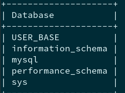
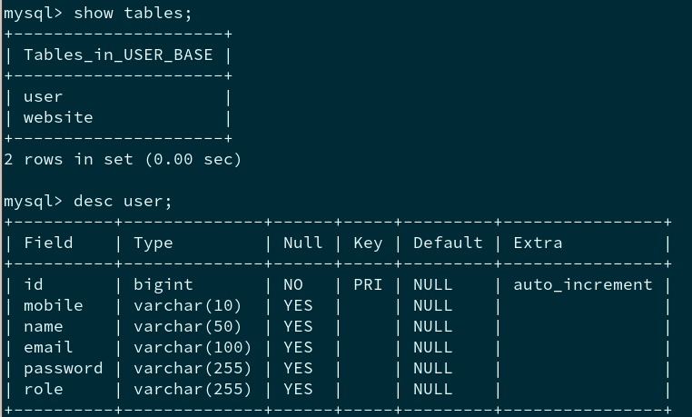
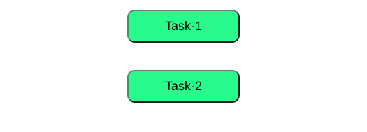
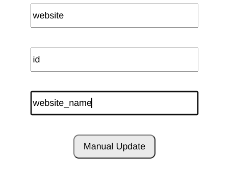
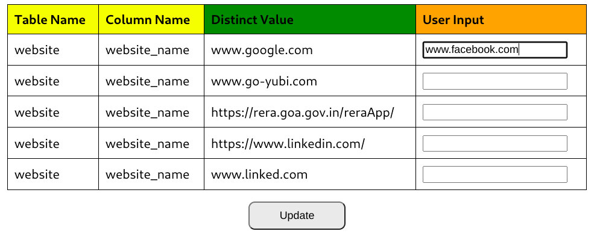
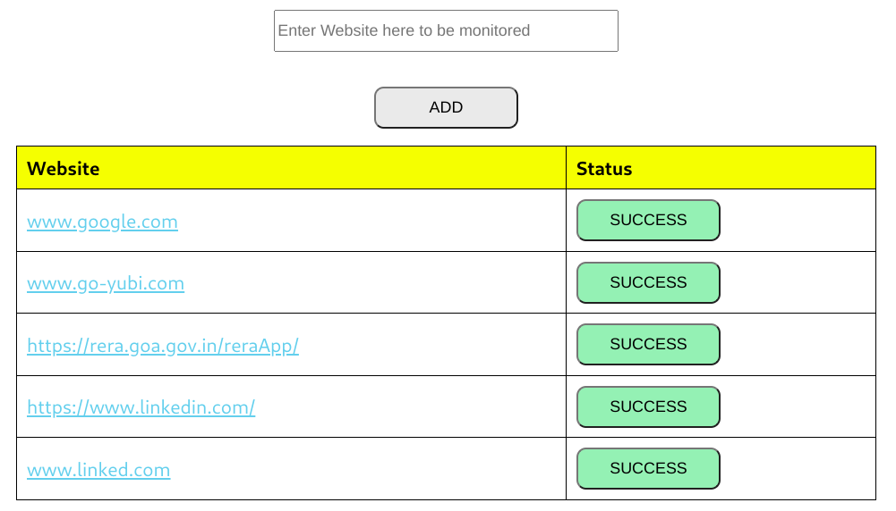

# task-Jan-29-2024
Task Completed for both the attached files.

## Data products Backend Project
Do to TaskProject/projects/backendproject. The project fulfils the requirement.
### Requirements
1. Gradle version 8.0 and above
2. Spring-boot version 3.1.8
3. java 17
4. mysql setup with database -> "USER_BASE"

### Fulfil Requirement
1. Add User
2. Delete user by ID
3. Update User By ID

## Data products Frontend Project
Do to TaskProject/projects/frontendproject. The project fulfils the requirement.

### UI Behaviour
Consists of 2 Button Task-1 and Task-2. Based on selection, the User will be directed to the selected task.
 

### Requirements
1. React 21.6.1
2. npm 10.2.4
3. Unzip my-task.zip
4. Execute code "npm install" -> to update and install all dependencies.

### Fulfil Requirement
1. Update the Table by giving the Table Name, Unique Column and Column Name. Database Connectivity supported. Uses the same Backend Project.
   

  
  
3. Updating the status of the URL every 2 minutes and stating if UP or DOWN. Database Connectivity supported. Uses the same Backend Project.

